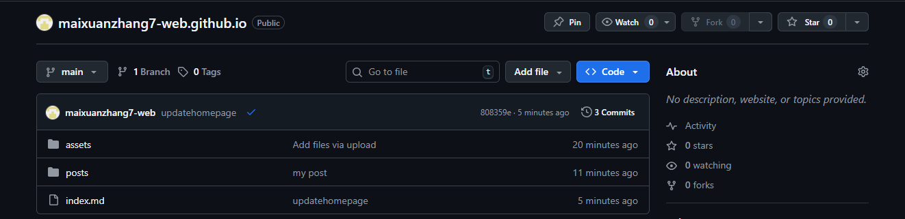

# Hello 2026！

> 2026年1月10日

其实我早就在今年1月1日就酝酿着整这么一个博客了，为什么不在新浪或者使用微博的头条文章呢？

其实原因主要在于：Github Page+markdown编写博客实在太丝滑太流畅太简洁。

如果回望一下过去，发现有许多事情还是值得记录在这么一个小破网站上的。没人打扰，干净清爽。

而选择在这里搭建个人博客的显然不只是我一个人。

我最开始建立这个小站点，是收到了[Hux黄玄](https://weibo.com/huxpro)的启发，建立了这么一个小破站点

[Hello 2015 - 黄玄的博客 | Hux Blog](https://huangxuan.me/2015/01/29/hello-2015/)

**2026加油吧**
